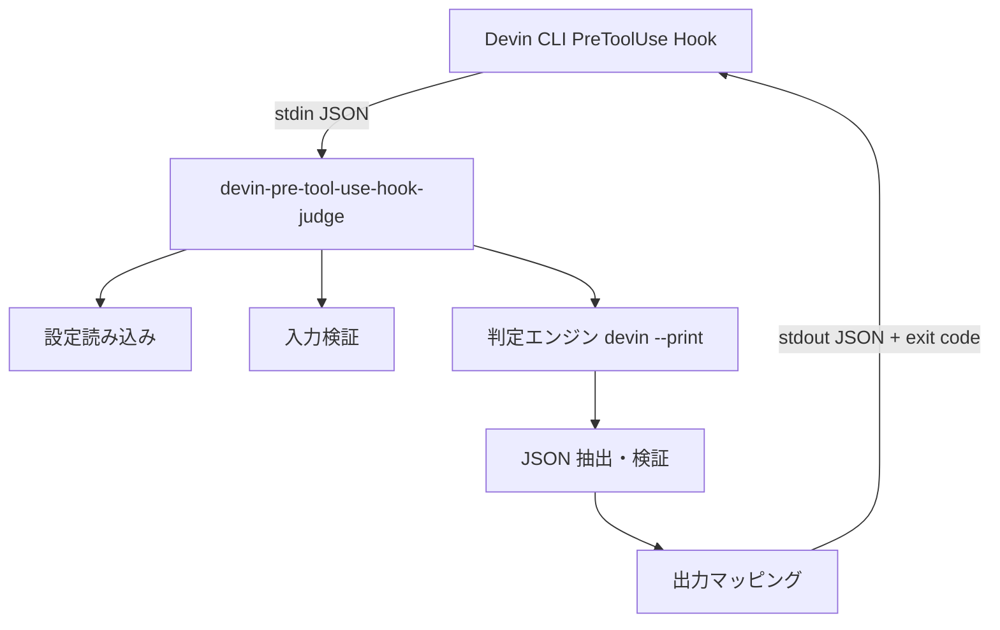

# 設計ドキュメント

本ドキュメントは [AGENTS.md](../AGENTS.md) の内容を人間向けに整理した設計資料です。

## 1. 背景と目的

### 背景

- Claude Code 向けの PreToolUse hook バリデータが Python + Claude Agent SDK で実装されていた
- Claude Code 解約に伴い、Claude Agent SDK 依存を排除したい
- Devin CLI でも同等の安全性判定を行いたい

### 目的

Devin CLI の command hook プロトコルに従い、ツール実行前に安全性を判定する単一バイナリを Go で提供する。

## 2. システム構成



### コンポーネント

| コンポーネント | 説明 |
|--------------|------|
| CLI (`main.go`) | フラグ解析、入出力接続 |
| App (`internal/app`) | 実行フローのオーケストレーション |
| Schema (`internal/schema`) | 型定義、検証、変換 |
| JSON Util (`internal/jsonutil`) | LLM 応答からの JSON 抽出 |
| Config (`internal/config`) | YAML 設定の読み込みと検証 |
| Judge (`internal/judge`) | 判定エンジン interface と Devin 実装 |

## 3. データフロー

### 3.1 入力処理

1. stdin から JSON を読み込む
2. `DevinInput` としてパース
3. 必須フィールド検証（`hook_event_name`, `tool_name`, `tool_input`）
4. 任意フィールドにデフォルト値を補完
5. `JudgeInput` に変換して判定エンジンへ渡す

### 3.2 判定処理

1. 設定 YAML から `prompt` を取得
2. プロンプトテンプレートに判定ルールと `JudgeInput` JSON を埋め込む
3. 一時ファイルに書き出し、`devin --print --prompt-file` を実行
4. 応答から JSON を抽出（コードフェンス対応）
5. `JudgeResult` としてパース・検証
6. 失敗時は最大 3 回リトライ

### 3.3 出力処理

1. `JudgeResult.decision` を `DevinOutput.decision` にマッピング
   - `approve` → `approve`（exit 0）
   - `deny` → `deny`（exit 2）
2. エラー時は `block`（exit 2）

## 4. 安全性設計

| 条件 | 動作 |
|------|------|
| 設定未指定 | `block` |
| stdin JSON パース失敗 | `block` |
| 入力スキーマ違反 | `block` |
| 判定エンジン実行失敗 | `block` |
| 判定結果 JSON 抽出失敗（3回後） | `block` |
| 判定結果スキーマ違反（3回後） | `block` |

## 5. 設定設計

### YAML スキーマ

```yaml
prompt: string   # 必須
model: string    # 任意、デフォルト "default"
timeout: duration # 任意、デフォルト "120s"
```

### ビルトイン設定

`internal/builtin/configs/` に embed し、実行時に `--builtin <name>` で読み込む。開発者向けに `builtin_configs/` にも同内容を配置。

## 6. テスト戦略

| レイヤ | テスト内容 |
|--------|-----------|
| `jsonutil` | `extractJSON` の単体テスト（フェンス除去、ネスト JSON 等） |
| `schema` | 入力検証、出力マッピング、終了コード |
| `config` | YAML / ビルトイン読み込み |
| `judge` | モックエンジン、プロンプト生成 |
| `app` | モック判定エンジンを使った統合テスト |

## 7. 運用上の注意

- hook の `timeout` は判定の `timeout` より長く設定する
- `devin` コマンドが PATH にあることを確認する
- ビルトイン設定の `model: haiku` 等は Devin CLI 環境に合わせて調整する

## 8. 今後の拡張

- 追加ビルトイン設定の移植
- 構造化出力 API が Devin CLI に追加された場合の対応
- キャッシュや並列実行の最適化
